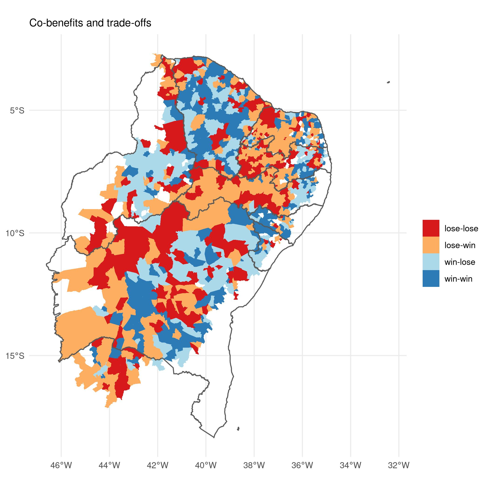

```{r, echo=FALSE}
xaringanExtra::use_tile_view()
xaringanExtra::use_scribble()
xaringanExtra::use_fit_screen()
xaringanExtra::use_share_again()

```

# Research overview
--

##- The origins of my research
--

##- My curernt research
--

##- Future plans for the University of Porstmouth
--

---
# Ecological interactions - Seed Dispersal

.pull-left[
###- BSc in Biology
###- MSc in Plant Biology


]
.pull-right[
### - Dr. Marcelo Tabarelli - UFPE (supervisor)


]

---
# Conservation Biology - Forest succession
.pull-left[
###- PhD in Biological Sciences - Ecology
###- First Research Grants


]
.pull-right[
### - Dr. Gerardo Ceballos - UNAM (supervisor)


]

---
# PostDoc at UFPE and NGO experience (2009-2010)
.pull-left[
###- Biotic homogenization
###- Restoration


]

--
.pull-right[
### Restoration Science and Politics


]

---
# Permanent position at UFPE (January 2011 - Present)
.pull-left[

]
.pull-right[
## Apllied Ecology Lab

###- Reserach
###- Teaching
###- Mentoring
###- Divulgation
###- Administration
]

---
.pull-left[
# Research theme 1:

# Tree assemblages in human-modified landscapes
###- Fucntional
###- Phylogeneitc
###- Taxonomic
###- Landscape Ecology
]
.pull-right[
## Main collaborators
###- Victor Arroyo-Rodríguez - UNAM (México)
###- Braulio A. Santos - UFPB (Brazil)
###- Marcelo Tabarelli - UFPE (Brazil)


]

---
# Selected outputs 
.pull-left[
### Publcations


]
.pull-right[
### Hundreds of students trained in field courses in Brazil and México
.center[


]]

---
.pull-left[
# Research theme 2:

# Ecological Restortaion 
###- Political ecology of restoration
###- Participatory restoration
###- Biolotical invasion

]
.pull-right[
## Main collaborators
###- Robin Chazdon - Uni Colorado (USA)
###- Pedro Brancalion - USP (Brazil)
###- Severino Pinto - Cepan (Brazil)


]

---
.pull-left[
# Selected outputs 

### Publcations


]
.pull-right[
### Restoration public policy
.center[


]]

---
.pull-left[
# Research theme 3:

# Social-ecological systems 
###- Political ecology of woodfuel
###- Forest-poverty relationship
###- Ethnoecology

]
.pull-right[
## Main collaborators
###- Luke Parry - Lancaster University (UK)
###- Ulysses P. Albuquerque - UFPE (Brazil)
###- Cristina Baldauf - UFERSA (Brazil)


]

---
.pull-left[
# Selected outputs 
### Publcations


]
.pull-right[
### Calculating water, energy, foood and forest security for the Brazilian Dry Forests
.center[

]]

---
.pull-left[
# Conservation biology: a cross research theme:

## 
###- Protected Areas
###- Conservation Policy
###- Political Ecology


]
.pull-right[
## Applied outcomes


]

---
.left-column[
# Future Research Plans

###- Peoples's depedency on forest

]
.right-column[
.pull-left[


### Alencar et al (submited)
]
.pull-right[

]
]

---
.left-column[
# Future Research Plans

###- Biodiversity-Ecosystem Function relationhships

]
.right-column[
<iframe width="780" height="521" src="https://www.youtube.com/embed/C21RHdxeu3E" title="YouTube video player" frameborder="0" allow="accelerometer; autoplay; clipboard-write; encrypted-media; gyroscope; picture-in-picture" allowfullscreen></iframe>
]

---
.left-column[
# Facilities needed

###- Office to work
###- Collectve spaces for students (eg. dedicated or shared lab, meeting rooms)
###- Technical support for fund raising in UK
]

.right-column[

]

---
# Potential collaborations at University of Portsmouth
.pull-left[
## Selected research groups
###- Evolutionary ecology of plant reproduction
###- Invasive species and biogeography
]

.pull-right[

]

---
class: middle, center

# Thank you


