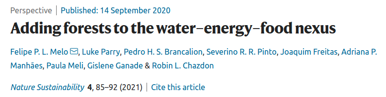

```{r, echo=FALSE}
xaringanExtra::use_tile_view()
xaringanExtra::use_scribble()
xaringanExtra::use_fit_screen()
xaringanExtra::style_share_again(share_buttons = c("twitter", "facebook"))
library(xaringanExtra)
```

# Presentation structure
--

##- Origins of my research
--

##- My current research interests
--

##- Future plans for the Copernicus Institute

---
class: middle, center

# My trainning as scientist (1996-2011)


---
```{r xaringan-panelset, echo=FALSE}
xaringanExtra::use_panelset()
```
# Bachelor and Master's degrees (1996-2004)
.panelset[
.panel[.panel-name[Supervisor]
.pull-left[
### [Dr. Marcelo Tabarelli](https://scholar.google.com.br/citations?user=Q2l5wHAAAAAJ&hl=pt-BR) 
.pull-left[

]
.pull-right[

]]
.pull-right[
### One of the most renowned ecologist of Latin America
### Introduced me to dialogues with private sector, governments and NGOs
### Among the most 10k most influent scientists in the woorld (Clarivate)
]]
.panel[.panel-name[Research]
.pull-left[
## "How defaunation affect seed dispersal processes in fragmented landscapes"?
### - Anthopocene defaunation
### - Forest Succession
### - Landscape Ecology
]
.pull-right[

.pull-left[

]
.pull-right[

]
]]
.panel[.panel-name[Grants]
.pull-left[
##Student fellowships
.pull-left[


]
.pull-right[

]
]
.pull-right[
## 12 months for BSc degree
## 24 months for MSc desgre

]]
.panel[.panel-name[Outputs]
.pull-left[
## My first papers published

]
.pull-right[


]]]

---
# PhD degree (2004-2009)
.panelset[
.panel[.panel-name[Supervisor]
.pull-left[
### Dr. Gerardo Ceballos 
.pull-left[

]
.pull-right[

]]
.pull-right[
### Highly regarded Conservation Scientist
### Defaunation in the Anthropocene and Sixth Extinction
### Very infnluential in Conservation Politics in Mexico
]]
.panel[.panel-name[Research Theme]
.pull-left[
## How plant-animal interactions are affected by patch area?
### - Forest Succession
### - Landscape Ecology
### - Conservation
]
.pull-right[

### Maya forest, Calakmul ruins, México

]]
.panel[.panel-name[Grants]
.pull-left[
## Capes-Brazil
## Full fellowship (48 months)

]
.pull-right[
## Research grants (~30k USD)


]]
.panel[.panel-name[Outputs]
## Papers and collaborations
.pull-left[

]
.pull-right[

]
]]

---
class: center, middle
# My training on natural sciences gave me a robust backgroud in ecology. 
# My interest on biodiversity conservation and applied sciences pushed me beyond. 
# The seeds of interdisciplinarity were sown.

---
# PosDoc and NGO (2009-2011) 
.panelset[
.panel[.panel-name[Dual experience]
.pull-left[
## PosDoc Position @ UFPE 
### - Teaching
### - Mentoring
### - Research
### - Fundraising
]
.pull-right[
## Director of Projects @ CEPAN
### - Restoration program
### - PES Program
### - Fundraising
### - Politics
]]
.panel[.panel-name[Research Themes]
.pull-left[
## How hyper abundant native species cause biotic homogenization?
### - Ecological restoration
### - Landscape Ecology
### - Conservation
### - Novel ecosystems/landscapes
]
.pull-right[


]]
.panel[.panel-name[Grants]
.pull-left[
## Capes-Brazil
## Fellowship (60 months)

]
.pull-right[
## Research and conservation grants (~200k USD)


]]
.panel[.panel-name[Outputs]

.pull-left[
## Many theoretical and applied papers and collaborations
### - [Lobo et al 2011](https://onlinelibrary.wiley.com/doi/full/10.1111/j.1472-4642.2010.00739.x)
### - [Tabarelli et al 2012](https://www.sciencedirect.com/science/article/pii/S0006320712002893)
### - [Melo et al 2013](https://www.sciencedirect.com/science/article/pii/S1462901113001494)
### - [Bernard et al 2011](https://journals.sagepub.com/doi/full/10.1177/194008291100400305)
]
.pull-right[
## Political influence and intersectorial dialogue
.pull-left[
]
.pull-right[

]
]]]

---
class: center, middle
# This dual experience improved my skils of fundraising and dialogue with diverse stakeholders 
# This continues to date...

---
class: middle, center

# My current work

---
# Permanent position at UFPE (January 2011 - Present)
.pull-left[

]
.pull-right[
## [Apllied Ecology Lab](www.ecoaplic.org)

###- Research (>50 scientific papers)
###- Teaching (various ecology courses)
###- Supervising (6 PhD; 8 MSc; 15 BSc)
###- Service (Scientific committees)
###- Administration (Vice-head of department and head of BSc degree)
]

---
class: middle, center

# Research Interests
---
# Neotropical human-modified landscapes
.panelset[
.panel[.panel-name[Research overview]
.pull-left[
##- Functional ecology
##- Species assembly
##- Response to distubance
##- Landscape Ecology
]
.pull-right[
## Main collaborators
###- [Victor Arroyo-Rodríguez - UNAM (México)](https://scholar.google.com.br/citations?user=JCit_KMAAAAJ&hl=pt-BR)
###- [Braulio A. Santos - UFPB (Brazil)](https://scholar.google.com.br/citations?user=6Y2M1JAAAAAJ&hl=pt-BR)
###- [Marcelo Tabarelli - UFPE (Brazil)](https://scholar.google.com.br/citations?user=Q2l5wHAAAAAJ&hl=pt-BR)


]]
.panel[.panel-name[Research grants]

.pull-left[
## As principal investigator


## 15k USD]
.pull-right[
## As collaborator


]


]

.panel[.panel-name[Selected outputs]
.pull-left[
### Publications


]
.pull-right[
## Long-term training program (Brazil-México)
### Field courses
.pull-left[

]
.pull-right[

]]]]


---
# Restoration 
.panelset[
.panel[.panel-name[Research overview]
.pull-left[
##- Political ecology of restoration
##- Participatory restoration
##- Biological invasion

]
.pull-right[
## Main collaborators
###- [Robin Chazdon - Uni Colorado (USA)](https://scholar.google.com.br/citations?user=utgfbkgAAAAJ&hl=pt-BR)
###- [Pedro Brancalion - USP (Brazil)](https://scholar.google.com.br/citations?user=0f_YV1wAAAAJ&hl=pt-BR)
###- [Severino Pinto - Cepan (Brazil)](https://scholar.google.com.br/citations?user=XiKoNzIAAAAJ&hl=pt-BR)


]]
.panel[.panel-name[Research grants]
.pull-left[
## As principal investigator


## 25k USD
]
.pull-right[
## As collaborator


]]

---
.panel[.panel-name[Selected outputs]
.pull-left[
### Publications


]
.pull-right[
### Public policies on Restoration


]]]

---
# Social-ecological systems 
.panelset[
.panel[.panel-name[Research overview]
.pull-left[
##- Use of natural resources
##- Forest-poverty relationship
##- Ethnoecology


]
.pull-right[
## Main collaborators
###- [Luke Parry - Lancaster University (UK)](https://scholar.google.com.br/citations?user=gOsY_7gAAAAJ&hl=pt-BR&oi=ao)
###- [Ulysses P. Albuquerque - UFPE (Brazil)](https://scholar.google.com.br/citations?user=JnPswr0AAAAJ&hl=pt-BR)
###- [Cristina Baldauf - UFERSA (Brazil)](https://scholar.google.com.br/citations?user=5cwmkkQAAAAJ&hl=pt-BR&oi=ao)


]]
.panel[.panel-name[Research grants]
.pull-left[
## As principal investigator


## 180k USD
]
.pull-right[
## As collaborator


]]

.panel[.panel-name[Selected outputs]
.pull-left[
### Publications


]
.pull-right[
### Lead Author in the IPBES Nexus Assessment


[Melo et al. (2021)](https://www.nature.com/articles/s41893-020-00608-z)
]]]

---
# Conservation biology: a cross-disciplinary research theme
.panelset[
.panel[.panel-name[Research overview and publications]
.pull-left[

##- Sspatial prioritization, effectiveness of Protected Areas
##- Conservation Policy
##      - PES legislation, Conservation conflicts
##- Political Ecology
  - 

]
.pull-right[
## Selected publications


]]
.panel[.panel-name[Creation of Protected Areas (video)]
<iframe width="900" height="450" src="https://www.youtube.com/embed/rQHAgyrXims" title="YouTube video player" frameborder="0" allow="accelerometer; autoplay; clipboard-write; encrypted-media; gyroscope; picture-in-picture" allowfullscreen></iframe>
]
]

---
# Public policy
.panelset[
.panel[.panel-name[IPBES]
.pull-left[

##- Nexus Assessment
### - Lead author of the chapter: "Chapter 5.4: Options for delivering sustainable approaches to elements of the nexus (biodiversity conservation, restoration and sustainable use)" 

]
.pull-right[
## 


]]
.panel[.panel-name[BPBES]
## [Brazilian Platform of Biodiversity and Ecosystem Services](www.bpbes.net.br)
### Merber of the Scientific Committee
### Coauthored two BPBES reports (governance and restoration)
### Coauthoring a new one Biodiversity and Agriculture (in preparation)
]
]

---
class: middle, center

# What is next?

---
.left-column[
# Future Research Plans
## Effects of climate change on forest security


**Research Grant 30k €**


]
.right-column[

.right[

### Assessing the role of forests for water, energy and food securities


]
]


---
.left-column[
# Future Research Plans
## Biodiversity-Ecosystem Function Relationhships
**Research Grant 72k €**


]
.right-column[
<iframe width="780" height="521" src="https://www.youtube.com/embed/C21RHdxeu3E" title="YouTube video player" frameborder="0" allow="accelerometer; autoplay; clipboard-write; encrypted-media; gyroscope; picture-in-picture" allowfullscreen></iframe>
###- in partnership with [Dr. Thiago Gonçalves-Souza](https://scholar.google.com/citations?user=TjaP2l8AAAAJ&hl=pt-BR)
]

---
# The Copernicus Institute of Sustainable Development
.pull-left[

## Selected areas of expertise and research fields

###- [Governance](https://www.uu.nl/en/research/copernicus-institute-of-sustainable-development/research/governance)
###- [Sustainable Land](https://www.uu.nl/en/research/copernicus-institute-of-sustainable-development/sustainable-land)
###- [Sustainable Food](https://www.uu.nl/en/research/copernicus-institute-of-sustainable-development/sustainable-food)


]

.pull-right[

]

---
# Training new scientists (BSc)
.pull-left[

## [Global Sustainability Science](https://www.uu.nl/bachelors/en/global-sustainability-science)


]
.pull-right[
## Planed courses
### Field-course of ecology and conservation of novel landscapes
### Landscape ecology
]
---
# Training new scientists (MSc)
.pull-left[
## [Sustainable Development](https://www.uu.nl/masters/en/sustainable-development)


]
.pull-right[
## Planed courses
### Field-course of ecology and conservation of novel landscapes
### Landscape ecology
### Political ecology
]
---
# Training new scientists (PhD)
.pull-left[
## Immediate 


]
.pull-right[
## [Brazil-Netherlands](https://www.netherlandsandyou.nl/documents/publications/2021/07/14/the-netherlands-and-brazil-20-showcases-of-collaboration-in-science-technology-and-innovation)
### U Wageningen-UF Viçosa
### [NWO-Fapesp](https://fapesp.br/12907/call-for-proposals-nwo-fapesp-joint-call-for-proposals-healthy-ageing)
### [TU Delft-Unicamp](https://www.tudelft.nl/en/joint-research-centres/tu-delft-brazil)
### Copernicus -???
]
---
# Fundraising
.pull-left[


### Latin American sources


]
.pull-right[

### European sources


]
---

class: middle, center
# Dank u well
# Thank you
# Obrigado


